# 02 — Arquitectura Actual

## Diagrama — arquitectura como REALMENTE se ejecuta hoy (no la declarada)

```mermaid
flowchart TD
    U[Usuario] -->|login/signup| Auth[Supabase Auth]
    U -->|crea análisis, INSERT directo| DB[(Postgres: analyses)]
    U -->|sube documento| UP[Edge Function: upload-document]
    UP --> Storage1[(Storage: financial-documents)]
    UP --> DB

    U -->|dispara pipeline| RAP[Edge Function: run-analysis-pipeline]
    RAP --> PD[parse-document]
    RAP --> MA[map-accounts]
    RAP --> VA[validate-analysis]
    RAP --> BSI[build-structured-input]
    RAP --> EC[ejecutar-calculo]

    PD -->|fallback si <3 filas| IA[Anthropic API]
    MA -->|Pass 2, cuentas sin clasificar| IA
    PD --> DP[(documents_parsed)]
    MA --> AH[(account_homologations)]
    VA --> VR[(validation_results)]
    BSI --> SI[(structured_inputs)]
    EC --> CR["(analyses.calculation_result — JSONB, columna)"]

    CR -.->|NUNCA se lee desde el frontend| X1[["punto muerto"]]

    GN[generate-narrative] -.->|NUNCA se invoca desde run-analysis-pipeline| X2[["huérfana, no en el flujo real"]]
    GN --> IA
    GN --> RN[(report_narratives)]
    GN -.-> EN1[enviar-notificacion: analisis_completado]

    U -->|descarga PDF, botón en Dashboard| DASH[Dashboard.tsx: handleDownloadPDF]
    DASH -->|lee SOLO input_payload| SI
    DASH -->|recalcula todo, motor independiente| FE[financial-engine.ts: runAnalysis]
    FE --> PDF[pdf-generator.ts: genera PDF en el navegador]
    PDF -->|jsPDF.save, nunca sube a Storage| U

    RAP -->|falla validate-analysis| EN2[enviar-notificacion: analisis_bloqueado]
    RAP -->|catch global| EN3[enviar-notificacion: error_analisis]
    EN2 --> Resend[Resend API]
    EN3 --> Resend
    EN1 --> Resend

    subgraph "Revisión manual"
        AR[AdminReviews.tsx] --> MRA[manual-review-api.ts]
        MRA --> MR[(manual_reviews)]
        MRA --> CTR[continuar-tras-revision]
        CTR --> SI
    end

    UPD[update-snapshots] -.->|sin cron, sin invocador| ES[(external_snapshots)]
    CDF[check-data-freshness] -.->|sin cron, sin invocador| UJL[(update_jobs_log)]
    ES -.->|BSI sí la lee, pero EC nunca la usa| X3[["desconectada del motor de cálculo"]]

    classDef dead fill:#333,stroke:#f66,color:#f66,stroke-dasharray: 5 5;
    class X1,X2,X3 dead;
```

## Frontend

React + Vite + React Router. 7 rutas (`Index`, `Auth`, `Dashboard`,
`AdminReviews`, `AdminReviewDetail`, `ResetPassword`, `NotFound`) — todas
importadas de forma estática, sin `React.lazy` (ver
`09-RENDIMIENTO-Y-OBSERVABILIDAD.md`). Mapa completo de rutas en
`07-FRONTEND-RUTAS-Y-UX.md`.

## Backend — Supabase

- **Auth**: Supabase Auth estándar (`signUp`, `signInWithPassword`,
  `resetPasswordForEmail`, `updateUser`). Sin lógica custom de sesión.
- **Storage**: 2 buckets privados (`financial-documents`, `reportes-pdf`
  — este último sin uso real). Sin URLs públicas ni firmadas; toda
  descarga pasa por Edge Functions con service role.
- **Edge Functions**: 12 funciones Deno + `_shared/anthropic-client.ts`.
  Sin router compartido, sin `_shared/cors.ts` ni `_shared/auth.ts` (12
  copias del mismo bloque `corsHeaders`, 9 copias del mismo patrón de
  autenticación).
- **Base de datos**: Postgres con RLS habilitado en las 16 tablas
  reportadas por el negocio (nombres reales distintos, ver §1 abajo).

## IA

Anthropic directo (`claude-opus-4-8`), vía `_shared/anthropic-client.ts`.
Usado en 3 funciones: `parse-document` (fallback de extracción +
clasificación + detección de períodos), `map-accounts` (Pass 2 de
consolidación), `generate-narrative` (14 secciones + auditor de 6
criterios) — **esta última no se invoca en el flujo real** (ver diagrama).
Sin logging del contenido enviado; se envían filas contables detalladas y,
en `generate-narrative`, el nombre real de la empresa (ver
`05-SEGURIDAD-DATOS-RLS.md` §5).

## Generación de PDF

100% cliente (`jsPDF` + `jspdf-autotable`, `src/lib/pdf-generator.ts`), a
partir de un recálculo independiente en el navegador (`financial-engine.ts`),
no del resultado server-side. Nunca se persiste en Storage ni en
`generated_reports`.

## Correo

Resend, vía `enviar-notificacion`. 4 tipos de evento soportados, solo 2 se
disparan realmente en el flujo hoy (`analisis_bloqueado`, `error_analisis`)
— ver `08-INFRAESTRUCTURA-E-INTEGRACIONES.md`.

## Fuentes macro

`external_snapshots` (tabla), poblada por migración SQL + `update-snapshots`
(sin cron). **Nunca leída por `ejecutar-calculo`** — el motor de cálculo
usa sus propias constantes hardcodeadas, no la tabla "actualizable".

## Límites de confianza de este diagrama

- Basado en lectura estática de código, no en trazas de ejecución real en
  producción.
- El comportamiento exacto de `verify_jwt`/CORS a nivel de plataforma
  Supabase es INFERIDO, no verificado contra la consola real del proyecto.
- No se probó el comportamiento de aislamiento de Deno bajo concurrencia
  real (NO VERIFICABLE desde el repo).

## Puntos de fallo identificados

1. `run-analysis-pipeline` no libera el lock ni detiene el pipeline si
   `map-accounts` lanza una excepción (sigue a validación con datos
   parciales) — ver `06-CALIDAD-CODIGO-Y-PRUEBAS.md`.
2. `build-structured-input` tiene un timeout de 55s vía `AbortController`;
   si aborta, retorna HTTP 200 con `success:false` (inconsistente con los
   400/500 de otros pasos) — ver `03-FLUJOS-END-TO-END.md`.
3. Doble invocación de `map-accounts` sin lock propio puede duplicar filas
   en `account_homologations` (DELETE→INSERT sin protección de
   concurrencia) — ver `06-CALIDAD-CODIGO-Y-PRUEBAS.md`.

## Diferencias entre arquitectura declarada y real

| Declarado (`Negocio_Velarix_v4.1.md` / README) | Real (evidencia) |
|---|---|
| Un solo motor de cálculo determinístico con IA de apoyo | Dos motores independientes (servidor con IA + homologación, cliente sin IA); el que llega al cliente es el segundo |
| "Informe" incluye narrativa, riesgos, recomendaciones auditadas por IA | El estado `informe_generado` se alcanza sin ejecutar `generate-narrative` nunca |
| Revisión humana obligatoria antes de entregar (§8.3 del negocio) | El propio cliente puede auto-aprobar su revisión manual (sin rol real) |
| Datos macro/sectoriales actualizables (`update-snapshots`) | El motor de cálculo real (`ejecutar-calculo`) no lee esos datos actualizados nunca |
